# School_District_Analysis

## Overview of Project

Maria, who is the chief data scientist for a city school district, is tasked with the preparation and analysis of all standardized test and providing insights about school performance. As a result, Maria was assisted with the analysis of data on students' funding and standardized test scores, thus aggregating the data and show casing trends in school performance.

### Purpose

The purpose of this project is to further assist Maria in conducting the school district analysis once again due to potential academic dishonesty that was detected by the school board in reading and math grades of Thomas High School ninth graders. As a result of this two technical analysis has to be performed with the use of Python script, Pandas library and Jupyter notebook to help the school board in finalizing and reconsidering their decisions regarding school budgets and priorities. The two technical analysis that has to be carried out are as follows:

1. Replacing the math and reading scores for Thomas High School ninth graders' with NaNs.
2. Repeating the school district analysis.

## Results

This section of the report focuses on how replacing the math and reading scores for Thomas High School affected the analysis of the school district. 

### District Summary

Replacing the math and reading grades of Thomas High School ninth graders' with NaNs within the student data DataFrame had a slight affect on the average math score, passing math, passing reading and overall passing percentages among the 15 high schools comparing to the original district summary achieved earlier. The district summary of the initial district analysis  and the district summary after replacing the math and reading scores of ninth graders' with NaNs are shown in the images below respectively.

 The following changes are seen in the updated district summary DataFrame:

- The average math score dropped from **79%** to **78.9%**.
- The average reading score remained the same.
- Passing math percentage dropped from **75%** to **74.8%**.
- Passing reading percentage dropped from **86%** to **85.7%**.
- Lastly, the overall passing percentage dropped from **65%** to **64.9%**.

*Original district summary with math and reading scores of Thomas High School ninth graders:*

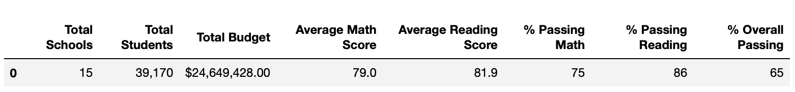

*Updated district summary after replacing the math and reading scores of Thomas High School ninth graders with NaNs:*

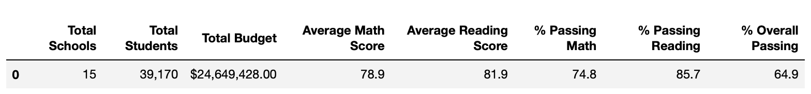

### School Summary

Initially when the math and reading scores of Thomas High School ninth graders' were replaced with NaNs, and prior to updating the per school summary DataFrame, it was shown that passing percentages of Thomas High School dropped to 60 percentile. This was predicted and considered misleading since the math and reading scores of ninth graders' were removed but the number of students were kept the same which resulted in a great percentage drop for Thomas High School since approximately quarter of students did not have grades but were still considered among the total student counts in the denominator as shown in the image below. 

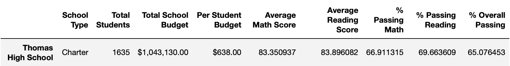

However, after updating the school summary and recalculating the percentages only for tenth to twelfth graders for Thomas High School, the percentages increased significantly back to the 90th percentile similar to the original district summary with negligibly small differences.

*Original per school summary with math and reading scores of Thomas High School ninth graders:*

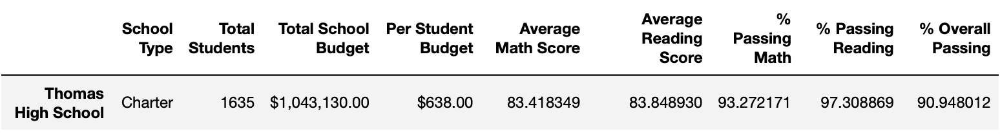

*Updated per school summary after recalculating the passing percentages using tenth to twelfth graders from Thomas High School:*

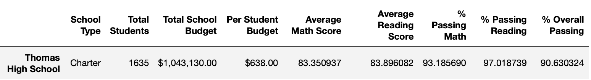

As shown in the figures above, the following changes can be seen for Thomas High School after updating the school summary using their tenth to twelfth graders:

- The average math score decreased by **0.07%**.
- The average reading score increased by **0.05%**.
- The passing math percentage dropped by **0.09%**.
- The passing reading percentage dropped by **0.3%**.
- The overall passing percentage dropped by **0.3%**.

### Thomas High School Performance

Although Thomas High School passing percentages dropped slightly but their performance was not affected as their passing percentages were still within the 90 percentile allowing them to maintain their position among the top five performing schools ranked as the second best similar to the original school district analysis.

*Top five performing schools of the original school district analysis with math and reading scores of Thomas High School ninth graders:*

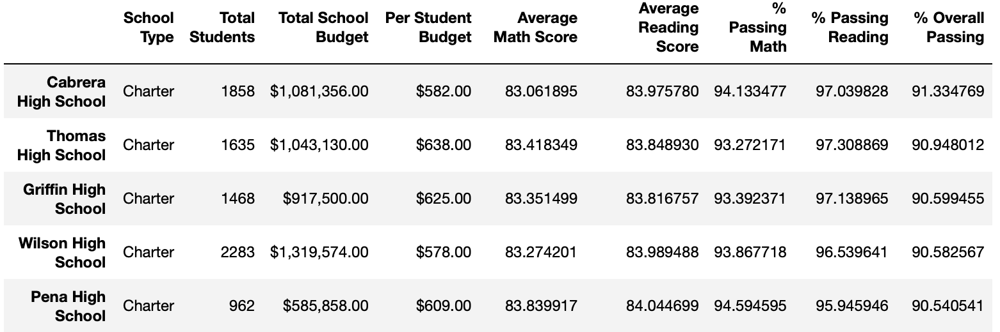

*Top five performing schools after replacing the math and reading scores of Thomas High School ninth graders with NaNs:*

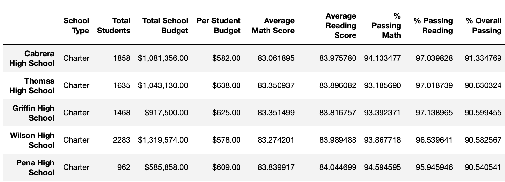

### Math and Reading Scores by Grade

Replacing the ninth-grade scores of Thomas High School with NaNs only affected the ninth graders math and reading score of Thomas High School with a substitution of NaNs while the math and reading scores of their 10-12th graders and all other schools remained intact. 

- **Math Scores by Grade**

The math scores by grade level of each school is illustrated in figures below both before and after replacing the ninth-grade scores of Thomas High School with NaNs. As it can be seen the math scores of Thomas High Schools ninth graders were substituted with NaNs where it previously was **83.6** and the math scores by grade for the remaining schools were unchanged.

*Math scores by grade level of the original dataset analysis with math and reading scores of Thomas High School ninth graders:*

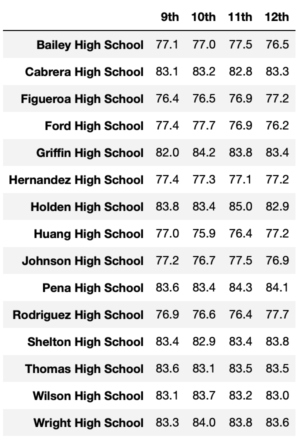

*Math scores by grade level after replacing the math and reading scores of Thomas High School ninth graders with NaNs:*

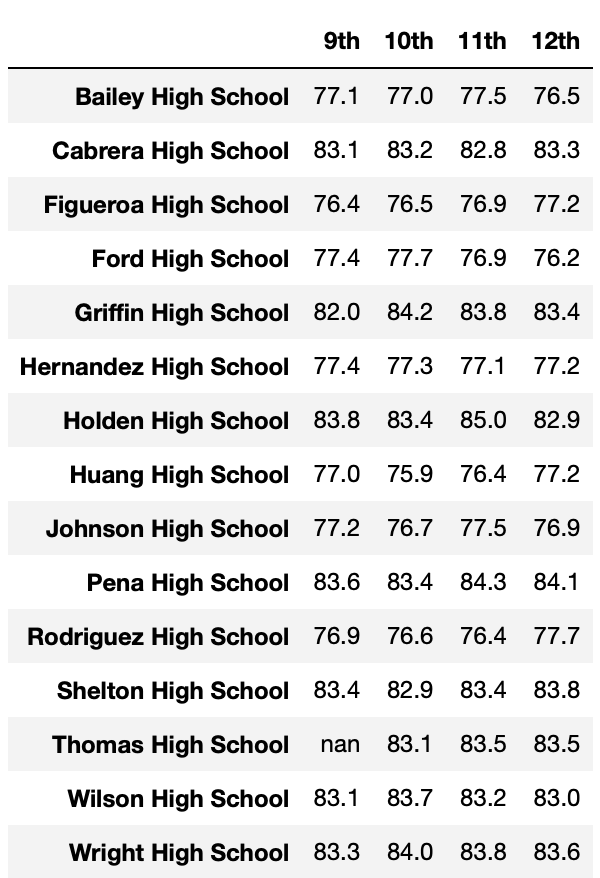

- **Reading Scores by Grade**

Similarly, the reading scores by grade level of each school is displayed in figures below both before and after replacing the ninth-grade scores of Thomas High School with NaNs. As it can be seen the reading scores of Thomas High Schools ninth graders were substituted with NaNs where it previously was **83.7**, additionally, the reading scores by grade were remain unchanged for all the remaining schools.

*Reading scores by grade level from the original dataset analysis with math and reading scores of Thomas High School ninth graders:*

*Reading scores by grade level after replacing the math and reading scores of Thomas High School ninth graders with NaNs:*

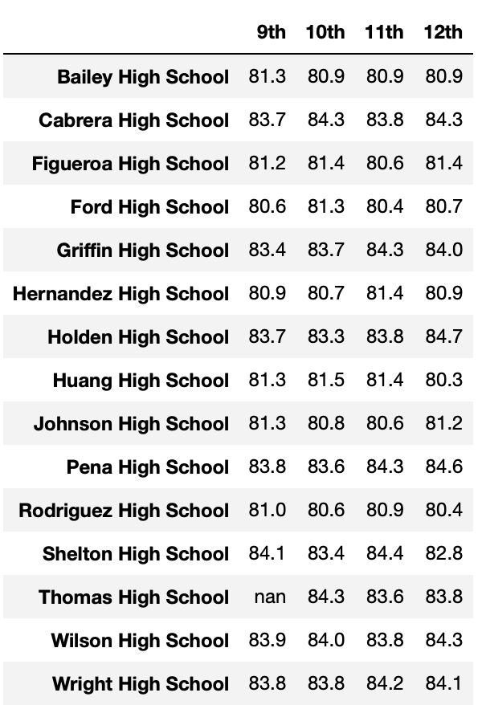

### Scores by School Spending

The average math and reading scores, as well as the passing math, reading and overall percentages by school spending for $630-644 bin where Thomas High School belongs to remained the same after replacing the math and reading scores of the Thomas High School ninth graders with NaNs as shown in the figures below. Additionally, the scores and percentages for the remaining bins were not affected since the spending per students as well as the school budget did not depend on certain grade scores of students.

*Spending Summary DataFrame with math and reading scores of Thomas High School ninth graders:*

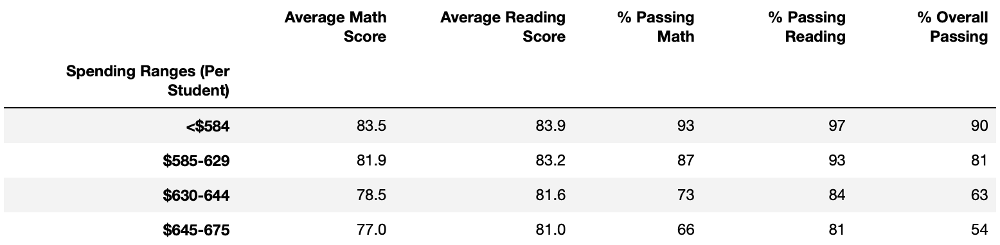

*Spending Summary DataFrame after replacing the math and reading scores of Thomas High School ninth graders with NaNs:*

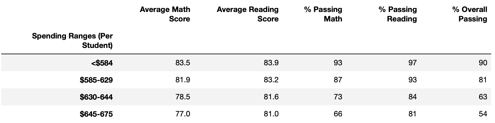

### Scores by School Size

The scores and percentages in terms of average math score, average reading score, passing math and reading scores, as well as the overall passing percentage remained the same for the medium school size bin where Thomas High School is categorized into after replacing the math and reading scores of their ninth graders' with NaNs, as shown in the size summary DataFrames before and after excluding reading and math scores of ninth graders. Additionally, the scores and percentages by school size of the remaining bins were not affected as well.

*Size Summary DataFrame with math and reading scores of Thomas High School ninth graders:*

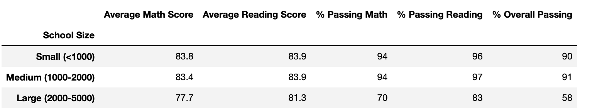

*Size Summary DataFrame after replacing the math and reading scores of Thomas High School ninth graders with NaNs:*

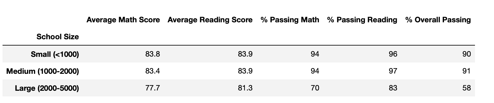

### Scores by School Type

Replacing the math and reading scores of Thomas High School ninth graders with NaNs did not have an impact on the average scores and passing percentages of the charter school type where Thomas High School is categorized into. Additionally, the scores and percentages per district school type bin also remained intact.

*Type Summary DataFrame with math and reading scores of Thomas High School ninth graders:*

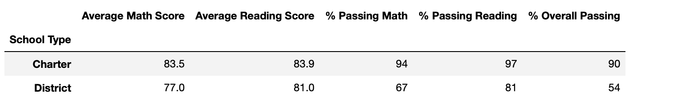

*Type Summary DataFrame after replacing the math and reading scores of Thomas High School ninth graders with NaNs:*

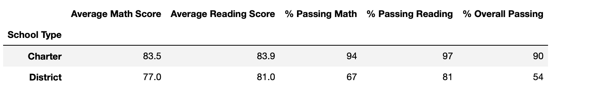

## Summary

After replacing the math and reading scores of Thomas High School ninth graders with NaNs, few changes were observed in the updated school district analysis.

In the district summary, it was seen that the passing math score was decreased by **0.1%**, the passing math percentage dropped by **0.2%**, the passing reading percentage dropped by **0.3%** and this lead to an overall passing percentage decrease of **0.1%**. Additionally, before updating the per school summary the passing percentages decreased to 60 percentile, however, after updating the school summary using the tenth to twelfth graders from Thomas High School, they regained their position as the second best performing school in the district with slight drop in their scores and passing percentages comparing to the original district analysis. Moreover, their passing math and reading percentages dropped by **0.09%** and **0.3%** respectively, causing their overall passing percentage to decrease from **90.95%** to **90.63%**.

